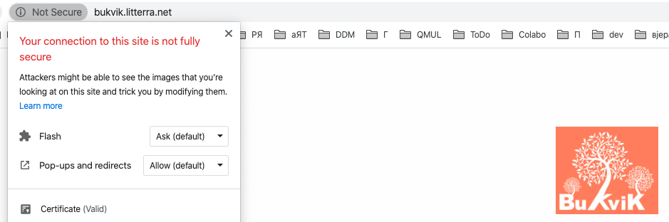

# Updating

```sh
cdz
cd colabo.space-infrastructure/provisioning/ansible


For: bukvik.litterra.net, cvrkut.litterra.net, druzba.litterra.net, legacy.litterra.net, perlaj.litterra.net, rc-apps.litterra.net, rc.litterra.net, read.litterra.net

For: cha-os.org, colabo.space, remakingtesla.com, savamrkalj.colabo.space, savamrkalj.com, tesla.colabo.space, www.cha-os.org, www.colabo.space, www.remakingtesla.com, www.savamrkalj.com

For `blogs`: climathon.colabo.space, colabo.space, litterra.net, sasarudan.com, www.colabo.space, www.litterra.net, www.sasarudan.com

ansible-playbook -i variables/hosts.yaml -e 'ansible_ssh_user=ansible' --private-key ~/.ssh/orchestration-iaas-no.pem --extra-vars '{"active_hosts_groups": ["blogs"]}' playbooks/nginx.yml

ansible-playbook -i variables/hosts.yaml -e 'ansible_ssh_user=ansible' --private-key ~/.ssh/orchestration-iaas-no.pem --extra-vars '{"active_hosts_groups": ["blogs"]}' --tags 'create_ssl' playbooks/nginx.yml

# For `instances`: 

ansible-playbook -i variables/hosts.yaml -e 'ansible_ssh_user=ansible' --private-key ~/.ssh/orchestration-iaas-no.pem --extra-vars '{"active_hosts_groups": ["instances"]}' --tags 'create_ssl' playbooks/nginx.yml

# For: read.litterra.net, druzba.litterra.net, legacy.litterra.net, bukvik.litterra.net, cvrkut.litterra.net, perlaj.litterra.net, rc.litterra.net, rc-apps.litterra.net

ansible-playbook -i variables/hosts.yaml -e 'ansible_ssh_user=ansible' --private-key ~/.ssh/orchestration-iaas-no.pem --extra-vars '{"active_hosts_groups": ["litterra"]}' --tags 'create_ssl' playbooks/nginx.yml

ansible-playbook -i variables/hosts.yaml -e 'ansible_ssh_user=ansible' --private-key ~/.ssh/orchestration-iaas-no.pem --extra-vars '{"active_hosts_groups": ["litterra"]}' playbooks/nginx.yml

For: apps.colabo.space, puzzles.colabo.space, psc.colabo.space, psc-test.colabo.space, clm.colabo.space, clm-test.colabo.space, manager.colabo.space, climathon-bg.colabo.space, climathon-apps.colabo.space

ansible-playbook -i variables/hosts.yaml -e 'ansible_ssh_user=ansible' --private-key ~/.ssh/orchestration-iaas-no.pem --extra-vars '{"active_hosts_groups": ["instances"]}' playbooks/nginx.yml


rc
wikis

colaboflow-1
colaboflow-2
orchestrator-bgo
```

## Problems

### Automatic cron

On read.litterra.net cron triggers and renews certificates. On blogs like cha-os.org and colabo.space, ... it doesn't

### Manual updating failed

if it fails we can:
+ check if nginx is up
+ check if ghosts are up
+ check if mysql db is up (should be reported by ghost anyway I guess)
+ check if nginx has ssl (not pre-ssl) versions of configs in its `sites-enabled` folder

If nginx is broken you can do full procedure instead (which is idempotent)

```sh
ansible-playbook -i variables/hosts.yaml -e 'ansible_ssh_user=ansible' --private-key ~/.ssh/orchestration-iaas-no.pem --extra-vars '{"active_hosts_groups": ["blogs"]}' --tags 'create_ssl' playbooks/nginx.yml
```

# Installing

```sh
cd /etc/nginx
sudo mkdir letsencrypt
cd letsencrypt
sudo wget https://dl.eff.org/certbot-auto
sudo chmod a+x certbot-auto
mkdir -p /var/www/ac-mediator/letsencrypt
```

#### Ansible

+ There is a package, but not looking great (need to run 2 phases, manual changes, etc): 
  + https://docs.ansible.com/ansible/2.5/modules/letsencrypt_module.html

### Generating certificate

```sh
sudo joe /etc/nginx/sites-available/ac-mediator

# This is just for us to test if NGINX is configured properly
# cert-bot creates `.well-known/acme-challenge/` folder automatically and removes it afterwards, together with challenges
mkdir -p /var/www/ac-mediator/letsencrypt/.well-known/acme-challenge/
echo "acme test" > /var/www/ac-mediator/letsencrypt/.well-known/acme-challenge/acme-test.html
cat /var/www/ac-mediator/letsencrypt/.well-known/acme-challenge/acme-test.html

# open the link and see if you can access the document
http://m2.audiocommons.org/.well-known/acme-challenge/acme-test.html
```

### Issuing certificates

```sh
#create certificate
cd /etc/nginx/letsencrypt
sudo ./certbot-auto certonly --agree-tos -m chaos.ngo@gmail.com --webroot -w /var/www/ac-mediator/letsencrypt -d m2.audiocommons.org
```

### Setting up certificate and SSL

```sh
sudo joe /etc/nginx/sites-available/ac-mediator
#<START>
server {
  # NEW PART
  listen 443 ssl;
  listen [::]:443 ssl; 

  # NEW PART
  ssl_certificate /etc/letsencrypt/live/m2.audiocommons.org/fullchain.pem;
  ssl_certificate_key /etc/letsencrypt/live/m2.audiocommons.org/privkey.pem;
  ssl_trusted_certificate /etc/letsencrypt/live/m2.audiocommons.org/chain.pem;

 location / {
    try_files $uri $uri/ /index.html;
  }

  # Allow the letsencrypt ACME Challenge
  # this is where letsencrypt will drop the callenge
  location /.well-known/acme-challenge/ {
    root /var/www/ac-mediator/letsencrypt/;
    default_type 'text/plain';
    allow all;
  }
}

# NEW PART
server {
  listen 80; 
  listen [::]:80; 
  server_name m2.audiocommons.org;
  return 301 https://m2.audiocommons.org$request_uri;
}
#<END>

# check config
sudo nginx -t -c /etc/nginx/nginx.conf
# restart new way
sudo service nginx reload
# or restart old way
sudo systemctl restart nginx.service
# if problems check
sudo tail /var/log/nginx/error.log

# Testing

Testing connections:

```sh
ansible all -i variables/hosts.yaml -u ansible --private-key ~/.ssh/orchestration-iaas-no.pem -m ping
```

+ **--check**: run in **dry mode** (just to see what it can do)

```sh
ansible --check all -i hosts.yaml -u ansible --private-key ~/.ssh/orchestration-iaas-no.pem -m ping
```

# Key Renewal

The certbot documentation recommends running a cron job twice per day to renew certificates. Let’s Encrypt will only renew certificates if they are due to expire, so it’s safe and good practice to run the renewal frequently.

```sh
sudo joe /etc/cron.d/letsencrypt
#<START>
# Run the letsencrypt renewal service using certbot-auto.
# once per day at 6:08am
 8 06 * * * root /etc/nginx/letsencrypt/certbot-auto renew --no-self-upgrade --post-hook '/bin/systemctl reload nginx.service'
#</END>
```

***IMPORTANT***: folder `letsencrypt` should exist in the web root that you asking certificate for. Example: `/var/www/fv/letsencrypt/`

# Troubleshooting

## Missing command line flag or config entry for the webroot

Solution: [Let’s Encrypt renewal simulation problem](https://community.letsencrypt.org/t/lets-encrypt-renewal-simulation-problem/43784/3)

```txt
Processing /etc/letsencrypt/renewal/savamrkalj.com.conf
- - - - - - - - - - - - - - - - - - - - - - - - - - - - - - - - - - - - - - - -
Cert is due for renewal, auto-renewing...
Plugins selected: Authenticator webroot, Installer None
Renewing an existing certificate
Performing the following challenges:
http-01 challenge for www.savamrkalj.com
http-01 challenge for savamrkalj.colabo.space
http-01 challenge for savamrkalj.com
Cleaning up challenges
Attempting to renew cert (savamrkalj.com) from /etc/letsencrypt/renewal/savamrkalj.com.conf produced an unexpected error: Missing command line flag or config entry for this setting:
Select the webroot for savamrkalj.colabo.space:
Choices: ['Enter a new webroot', '/var/www/ghost-savamrkalj/letsencrypt']

(You can set this with the --webroot-path flag). Skipping.
```

Solution:
+ Open config file (`/etc/letsencrypt/renewal/savamrkalj.com.conf`) and instead of:

```conf
# Options used in the renewal process
[renewalparams]
authenticator = webroot
account = 29b53809ff714d9b3d17279a89db4a32
webroot_path = /var/www/ghost-savamrkalj/letsencrypt,
server = https://acme-v02.api.letsencrypt.org/directory
[[webroot_map]]
www.savamrkalj.com = /var/www/ghost-savamrkalj/letsencrypt
```

make:

```conf
# Options used in the renewal process
[renewalparams]
authenticator = webroot
account = 29b53809ff714d9b3d17279a89db4a32
# not used anymore
# webroot_path = /var/www/ghost-savamrkalj/letsencrypt,
server = https://acme-v02.api.letsencrypt.org/directory
[[webroot_map]]
# here all domains should be covered
savamrkalj.com = /var/www/ghost-savamrkalj/letsencrypt
www.savamrkalj.com = /var/www/ghost-savamrkalj/letsencrypt
```

## Not Secure

Browser is reporting `not secure` website although you have certificate

https://check-your-website.server-daten.de/?q=litterra.net

### Images issues



```html

```

### Miscellaneous

Check your website:
+ https://check-your-website.server-daten.de/?q=litterra.net
+ for litterra.ne it says all fine there
+ it could be due to changing ip addresses as we swapped littera.net with blog.litterra.net
+ after rebooting machine, all was fine! :)

I checked www.litterra.net instead of litterra.net and it was secure
+ In the `colabo.space-infrastructure/provisioning/ansible/variables/nginx-list.json` there was in the `aliases` field `"aliases": "www.litterra.net",` instead of `"aliases": "litterra.net www.litterra.net",` but that should not be an issue


https://xneelo.co.za/help-centre/website/fix-not-secure-website-warning/
